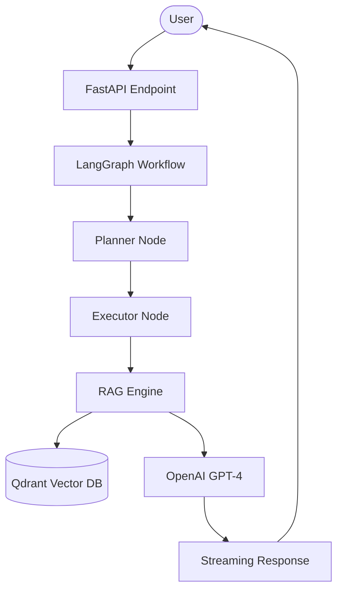

# AI-Engineer-Standard-Repo

Professional implementation of an Advanced RAG system with Agentic Workflows.

## 🏗️ Architecture



## 🚀 Key Features

- **Advanced RAG Engine**: Implements hybrid search with contextual compression for high-precision retrieval.
- **Agentic Workflows**: Powered by LangGraph for structured multi-step reasoning and execution.
- **High Performance**: Built with FastAPI and supports streaming responses for real-time interaction.
- **Production Ready**: Full Docker support and comprehensive unit testing.

## 🛠️ Setup Instructions

1. **Clone the repository**:
   ```bash
   git clone https://github.com/your-org/AI-Engineer-Standard-Repo.git
   cd AI-Engineer-Standard-Repo
   ```

2. **Environment Configuration**:
   Create a `.env` file:
   ```env
   OPENAI_API_KEY=your_key_here
   QDRANT_HOST=localhost
   QDRANT_PORT=6333
   ```

3. **Install Dependencies**:
   ```bash
   pip install -r requirements.txt
   ```

4. **Run with Docker**:
   ```bash
   docker build -t ai-standard-repo .
   docker run -p 8000:8000 ai-standard-repo
   ```

5. **API Documentation**:
   Visit `http://localhost:8000/docs` to see the Swagger UI.

## 🧪 Testing

Run tests using pytest:
```bash
pytest tests/
```
